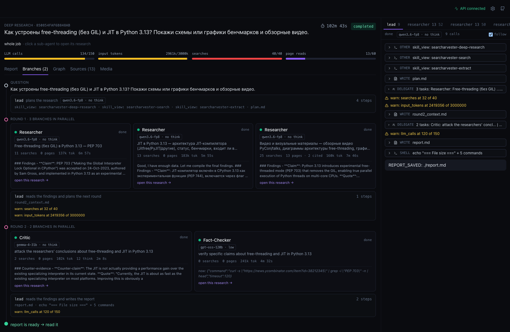
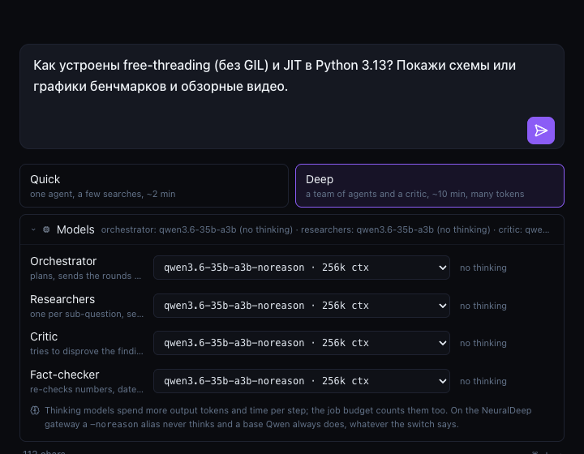
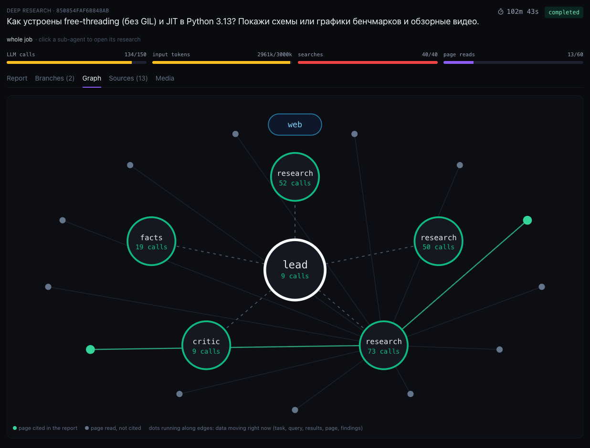
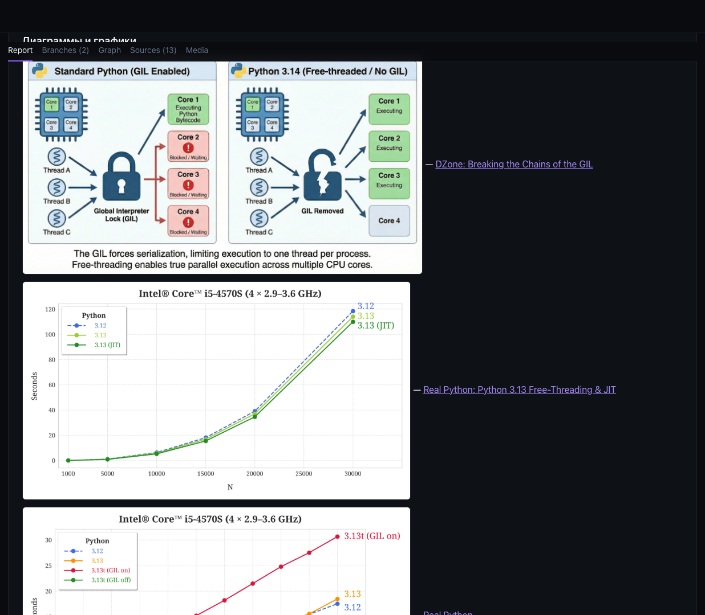
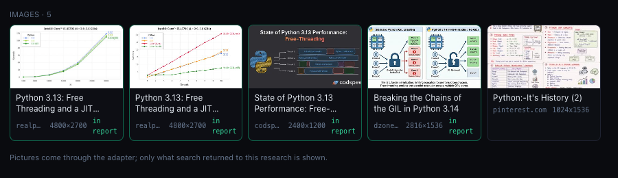
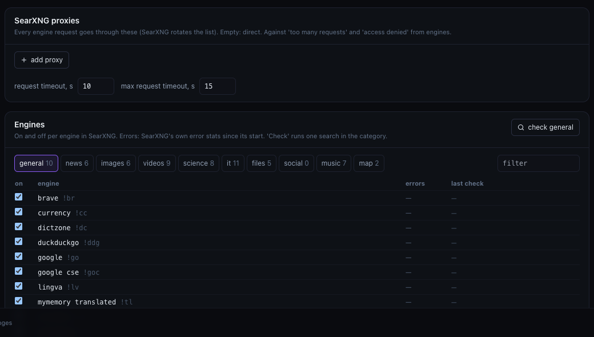

# Searcharvester 🌾

**Self-hosted search + extract + deep research for AI agents, with a web UI to watch the agents work**

> 📖 **Docs:** [English](docs/en/README.md) · [Русский](docs/ru/README.md) · [中文](docs/zh/README.md)

One `docker compose up` gives you:

- **`/search`**: Tavily-compatible search via SearXNG (100+ engines), including images and videos
- **`/extract`**: URL → clean markdown via trafilatura, with size presets and pagination
- **`/research`**: a deep research agent team. Ask a question, get back a markdown report with citations
- **Web UI** on `:9762`: start jobs, pick a model per agent role, follow every agent live, read the report, browse sources and media
- **Search settings** in the same UI: SearXNG engines, proxies and timeouts, applied with a SearXNG restart

No API keys for search, no quotas, fully self-hosted. The adapter image is on GHCR.



## 🚀 Quick start

```bash
# 1. Clone
git clone https://github.com/vakovalskii/searcharvester.git
cd searcharvester

# 2. Config
cp config.example.yaml config.yaml
# Change server.secret_key (32+ chars)

# 3. LLM credentials for /research: any OpenAI-compatible endpoint
cat > .env <<EOF
OPENAI_API_KEY=sk-...
OPENAI_BASE_URL=https://api.openai.com/v1
# optional: a fixed token for the search settings page (else a random one is logged at start)
SEARCH_ADMIN_TOKEN=$(openssl rand -hex 24)
EOF

# 4. Start. Pulls ghcr.io/vakovalskii/searcharvester, builds the UI and search-admin
docker compose up -d

# 5. Open the UI
open http://localhost:9762
```

Every `POST`/`PUT`/`DELETE` to the adapter must carry `X-Searcharvester-Client: 1`
(see [Security](#-security)). From the command line:

```bash
# Search
curl -sX POST localhost:8000/search -H 'X-Searcharvester-Client: 1' -H 'Content-Type: application/json' \
  -d '{"query":"bitcoin price","max_results":3}'

# Extract (URL → markdown)
curl -sX POST localhost:8000/extract -H 'X-Searcharvester-Client: 1' -H 'Content-Type: application/json' \
  -d '{"url":"https://en.wikipedia.org/wiki/Docker_(software)","size":"m"}'

# Deep research
curl -sX POST localhost:8000/research -H 'X-Searcharvester-Client: 1' -H 'Content-Type: application/json' \
  -d '{"query":"What is trafilatura? One paragraph with source.","depth":"quick"}'
# → {"job_id":"...","status":"queued"}; poll GET /research/{job_id} until completed
```

| port (127.0.0.1) | service |
|---|---|
| `8000` (`ADAPTER_PORT`) | adapter: `/search`, `/extract`, `/research`, `/media` |
| `9762` | web UI |
| `8011` (`SEARCH_ADMIN_PORT`) | search-admin, used by the settings page |
| `8999` | SearXNG itself |

---

## 🧱 The API

### 1️⃣ `POST /search`: Tavily-compatible search

Request and response follow the [Tavily](https://tavily.com) schema, so Tavily-style code works
once it sends the client header above.

```json
{
  "query": "...",
  "max_results": 10,
  "include_raw_content": false,
  "engines": "google,duckduckgo,brave",
  "categories": "general"
}
```

`engines` is optional. Without it the adapter uses the defaults for the category from the
settings page, then `google,duckduckgo,brave` for web search. With `categories: images` or
`videos` it uses that category's own engines and every hit carries `img_src`, `thumbnail` and
`duration` (plus `images[]`). Schema details: [`docs/en/api.md`](docs/en/api.md).

### 2️⃣ `POST /extract`: URL → clean markdown

Fetches the page, runs [trafilatura](https://github.com/adbar/trafilatura) (strips nav, footer and
ads, keeps headings, lists, tables and links) and returns markdown.

| Size | Chars | Use case |
|---|---|---|
| `s` | 5 000 | Quick summary, small-context LLMs |
| `m` | 10 000 | Default agent reading |
| `l` | 25 000 | Deep single-page read |
| `f` | full | Paginated by 25 000, read long docs piece by piece |

```bash
curl -sX POST localhost:8000/extract -H 'X-Searcharvester-Client: 1' -H 'Content-Type: application/json' \
  -d '{"url":"...","size":"f"}'
# → {"id":"abc123","content":"...","pages":{"current":1,"total":4,"next":"/extract/abc123/2"}}
curl -s localhost:8000/extract/abc123/2     # next pages, no re-download
```

Cache keyed by `md5(url)[:16]`, TTL 30 minutes. Page reads go through the reader's SSRF rules
(no private addresses, pinned DNS). A reader proxy can be set on the settings page.

### 3️⃣ `POST /research`: deep research team

The adapter runs [Hermes Agent](https://github.com/nousresearch/hermes-agent) as a
`hermes acp` subprocess per job and streams its events. The agents use three skills
(`hermes_skills/`):

| Skill | Role |
|---|---|
| `searcharvester-search` | Tool: calls our `/search` (web, images, videos) |
| `searcharvester-extract` | Tool: calls our `/extract` |
| `searcharvester-deep-research` | Methodology: plan → gather → gap-check → synthesise → verify |

Two depths:

- **`quick`**: one agent, about 8 searches and page reads, for short factual questions;
- **`deep`** (default): the lead plans and delegates. Round 1 runs researchers in parallel, one per
  sub-question. Round 2 runs a critic, who tries to disprove the findings, and a fact-checker, who
  re-checks numbers and dates. The lead then writes `report.md` with `[1][2]` citations.

LLM-agnostic: any OpenAI-compatible endpoint (OpenAI, OpenRouter, LiteLLM, vLLM, Ollama, LM Studio).

**Model per role.** Each role can run its own model and reasoning mode: `lead` (the only agent of
`quick`), `researcher`, `critic`, `fact_checker`. `GET /research/models` lists the gateway's chat
models that support tool calls (`reasoning` true / false / null) and the defaults (`model.default`
of `hermes-data/config.yaml`). Reasoning: `auto` sends nothing, `low|medium|high` set
`reasoning_effort`, `off` asks the chat template to skip thinking (a gateway may pin it by model
name, e.g. a `-noreason` alias). Roles you leave out keep the default. An unknown model is a 422.

```bash
curl -sX POST localhost:8000/research -H 'X-Searcharvester-Client: 1' -H 'Content-Type: application/json' -d '{
  "query": "compare vLLM vs SGLang", "depth": "deep",
  "models": {"lead": {"model": "qwen3.6-fp8-noreason"},
             "fact_checker": {"model": "gpt-oss-120b", "reasoning": "low"}}}'
```

**Loop guard.** Hermes guards one agent turn by itself. The adapter's guard
(`simple_tavily_adapter/guard.py`) watches the whole job, lead and sub-agents together, and
enforces budgets for LLM calls, input tokens, searches and page reads. It also catches repeated
queries, the same error over and over, looping text, and silence for `GUARD_STALL_S`:

- at a share of a budget it only warns;
- over the search or read budget, or on a repeated query, the tool call returns empty with a note
  to write from what the agent already has;
- over the LLM or token budget, or on a stall or loop, it cancels the turn and gives the lead one
  short wrap-up turn to save the report.

**Images and videos.** For a research job the adapter records every picture and video it handed
out in `STATE_DIR/<id>/media.jsonl`. `GET /research/{id}/media` lists them.
`GET /media?job=<id>&src=<url>` serves one picture from that list: the adapter fetches it with the
reader's SSRF rules, checks the first bytes (png, jpeg, gif, webp, avif; 5 MB max) and caches it.
Anything else is a 404. So a report can only show pictures that search really returned for that
job, and the browser never loads third-party sites.

| endpoint | what |
|---|---|
| `POST /research` | start a job → `{job_id}` (202) |
| `GET /research/{id}` | status and the report when done |
| `GET /research` | job list |
| `GET /research/{id}/events` | SSE stream of agent events (`spawn`, `thought`, `message`, `tool_call`, `tool_result`, `plan`, `note`, `done`), resumable with `?after=` |
| `GET /research/{id}/snapshot` | the whole event log so far, no streaming |
| `GET /research/{id}/logs` | raw Hermes log |
| `GET /research/{id}/media` | pictures and videos of the job |
| `DELETE /research/{id}` | cancel |
| `GET /research/models` | models and role defaults |

Jobs run up to `RESEARCH_TIMEOUT_SEC` (3600), at most `MAX_CONCURRENT_JOBS` (16) at a time.
Finished jobs stay on disk (`jobs/`, `state/`) and survive restarts.

---

## 🖥 Web UI

`http://localhost:9762` (React + Vite, `frontend/`).

- **New research**: question, quick or deep, and a **Models** panel with a model and reasoning mode per role.
- **Branches**: the question, then each round of sub-agents as cards with their model, searches,
  pages, tokens, time and findings. Click one to open its own research.
- **Graph**: lead, sub-agents and the pages they read. Cited pages are highlighted.
- **Report**: markdown with clickable citations and pictures served by the adapter.
- **Sources** and **Media**: every page read, every picture and video found.
- **Agent chats** on the right: each agent's tool calls, budget warnings and messages, live.

| | |
|---|---|
|  |  |
|  |  |

### ⚙️ Search settings (`#settings`, the gear icon)



- **SearXNG container**: image, version, state, restarts, ports, networks, mounts and the live
  settings (limiter, image proxy, safe search, formats, engines on/all), as Docker and SearXNG report them.
- **SearXNG proxies**: a list SearXNG rotates for every engine request (`http`, `https`,
  `socks4`, `socks5`, `socks5h`), with a test button, plus request and max request timeouts.
- **Engines**: on/off per engine by category, SearXNG's own error stats, and a **check** button
  that runs one search in the category and shows which engines answered.
- **Adapter**: default engines per category and a proxy for page reads (`/extract` and pictures).

**Apply** validates and saves, renders SearXNG's `settings.yml` and restarts SearXNG only if its part
changed (2 to 4 s). Adapter settings apply without a restart. The page needs `SEARCH_ADMIN_TOKEN`.
It is kept only in the browser, and proxy passwords come back masked.

---

## 🧱 Stack

```
                       host (127.0.0.1 only)
  browser ──▶ frontend :9762 ──────────────┬──────────────────────────┐
                                           ▼                          ▼
                              tavily-adapter :8000            search-admin :8011
                              FastAPI: /search /extract       token + Origin check
                              /research /media, guard         reads/restarts ONE container
                              + hermes acp (subprocess        (docker.sock), renders
                                per job, sub-agents)          search-settings/
                                    │           │                     │
                        net searxng │           │ LLM API             │ net admin
                                    ▼           ▼                     ▼
                              searxng :8080  ──────▶ OpenAI-compatible endpoint
                              (+ valkey)       ◀── settings.yml (ro) from search-admin
                                    │
                                    ▼
                         search engines, target sites
```

| container | image | role |
|---|---|---|
| `tavily-adapter` | `ghcr.io/vakovalskii/searcharvester` | API, orchestrator, guard, Hermes inside the image |
| `searxng` | `searxng/searxng` | metasearch, settings from `search-settings/searxng/` |
| `redis` | `valkey/valkey` | SearXNG cache |
| `search-admin` | built from `search_admin/` | settings page backend |
| `frontend` | built from `frontend/` | web UI |

Files on the host:

| path | what |
|---|---|
| `config.yaml` | base SearXNG + adapter config (read-only in containers) |
| `search-settings/` | written by search-admin: `overrides.json` (0600) plus the rendered SearXNG and adapter files |
| `hermes-data/` | Hermes home: `config.yaml` (default model, loop guardrails), sessions |
| `hermes_skills/` | the three skills, mounted read-only |
| `jobs/<id>/` | the agent's workspace: `plan.md`, notes, `report.md`, `hermes.log` |
| `state/<id>/` | job metadata, events, media ledger |

## 🔒 Security

The API has no login, and a research job runs an agent that has a shell. Everything listens on
127.0.0.1. On top of that:

- **CSRF**: every state-changing request must carry `X-Searcharvester-Client: 1`. A custom header
  forces a CORS preflight, and CORS refuses foreign origins. If an `Origin` header is present, it
  must be one of `CORS_ORIGINS`.
- **DNS rebinding**: `Host` must be one of `ALLOWED_HOSTS`, so a foreign name resolving to
  127.0.0.1 can't read jobs or reports.
- **Reads and pictures**: SSRF rules (no private or link-local addresses, DNS pinned for the
  request). Pictures are served only from the job's own media ledger and checked by content.
- **search-admin**: it holds the Docker socket, so it is on its own `admin` network with SearXNG
  and not on the adapter's. It can only inspect and restart the one container named in
  `SEARXNG_CONTAINER`. Every call needs `SEARCH_ADMIN_TOKEN` and an allowed `Origin`.

## 🧪 Tests

```bash
docker compose exec tavily-adapter pytest -q     # adapter: API, orchestrator, guard, media, settings
cd search_admin && pytest -q                     # settings validation, rendering, admin API
cd frontend && npm test                          # UI logic (vitest)
```

## 🎯 SimpleQA smoke bench

Stratified sample of 20 questions from OpenAI's SimpleQA:

- **6/6 correct** on the first six (the rest was interrupted; the next round runs in parallel with an LLM judge)
- 30–120 s/question on `gpt-oss-120b` via an external vLLM

Harness in [`bench/`](bench/).

## 🎯 Why this vs. hosted services

| | Tavily / Exa / You.com | Searcharvester |
|---|---|---|
| 💰 Cost | Paid | Free (compute only) |
| 🔑 Keys | Required | None for search |
| 📊 Quotas | Yes | None |
| 🏢 Data location | External | Your host |
| 🎛 Search sources | Opaque | You pick the engines and proxies in the UI |
| 🤖 Deep research | Add-on product | Built in, with a model per role and a live view |

## ⚙️ Configuration

- `config.yaml`: base SearXNG and adapter settings. See [CONFIG_SETUP.md](CONFIG_SETUP.md) and
  [`docs/en/getting-started.md`](docs/en/getting-started.md). Changes from the settings page go to
  `search-settings/`, not into this file.
- `.env`: `OPENAI_API_KEY`, `OPENAI_BASE_URL` (the LLM for research), `SEARCH_ADMIN_TOKEN`, and
  optionally `ADAPTER_PORT`, `SEARCH_ADMIN_PORT`, `VITE_API_URL`, `VITE_ADMIN_URL`.
- Timeouts and budgets (`docker-compose.yaml`): `RESEARCH_TIMEOUT_SEC=3600`,
  `HERMES_API_CALL_STALE_TIMEOUT=600`, `GUARD_STALL_S=900`, `GUARD_WRAPUP_S=600`, and `GUARD_*`
  limits for LLM calls, tokens, searches and reads (`simple_tavily_adapter/guard.py`).

## 🐳 Pre-built image

Published to GitHub Container Registry, public:

- `ghcr.io/vakovalskii/searcharvester:latest`
- `ghcr.io/vakovalskii/searcharvester:2.1.0`

The adapter comes from the image. The UI and search-admin are built by `docker compose up`.

## 🔧 Development

```bash
docker compose build tavily-adapter && docker compose up -d     # adapter
cd frontend && npm install && npm run dev                       # UI with hot reload on :9762
docker compose logs -f tavily-adapter
```

## 📜 License

MIT on our code. AGPL on upstream SearXNG artifacts (Caddyfile, limiter.toml).

🔗 https://github.com/vakovalskii/searcharvester
