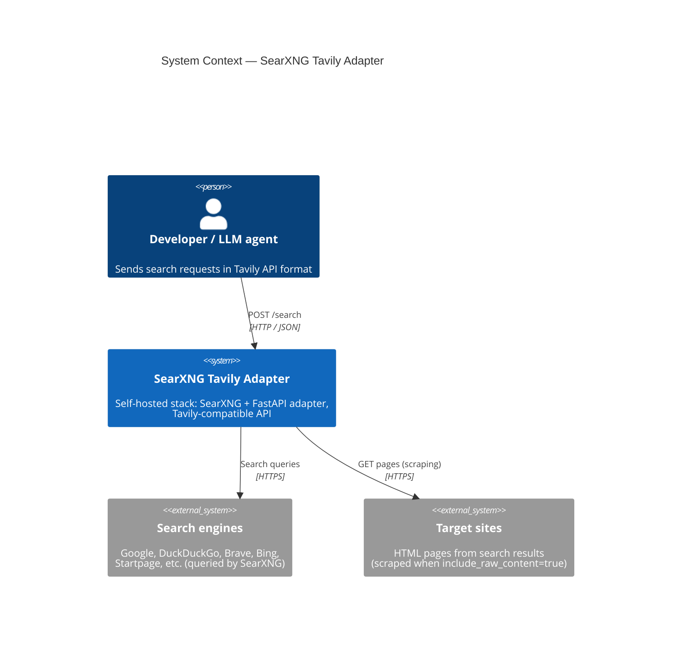
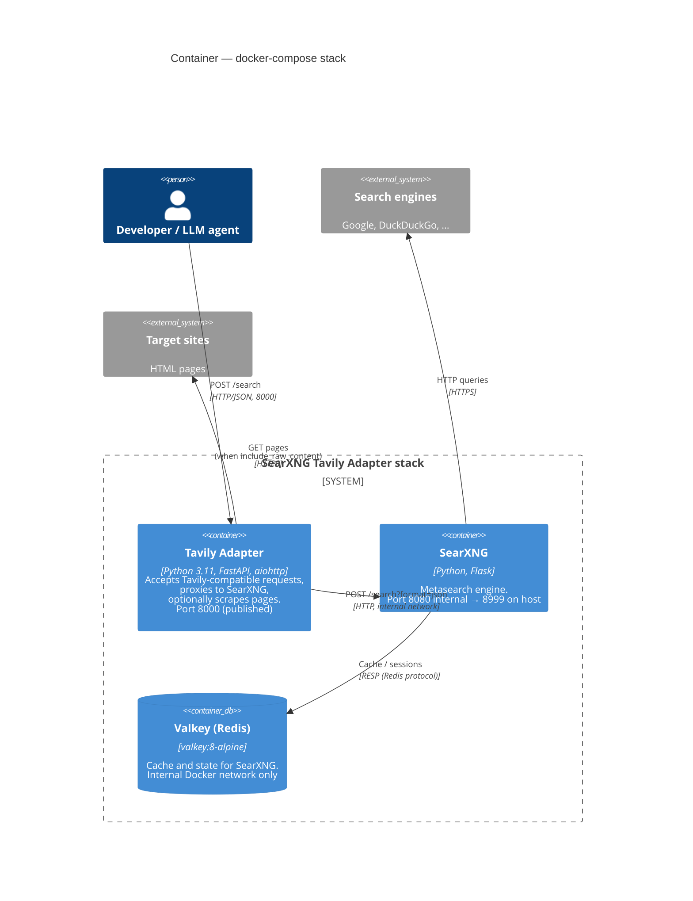
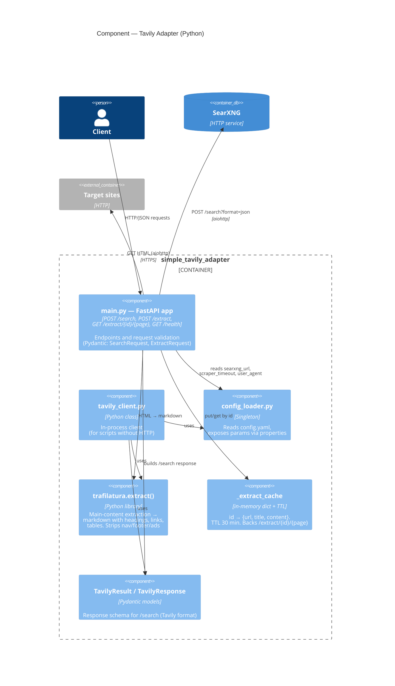
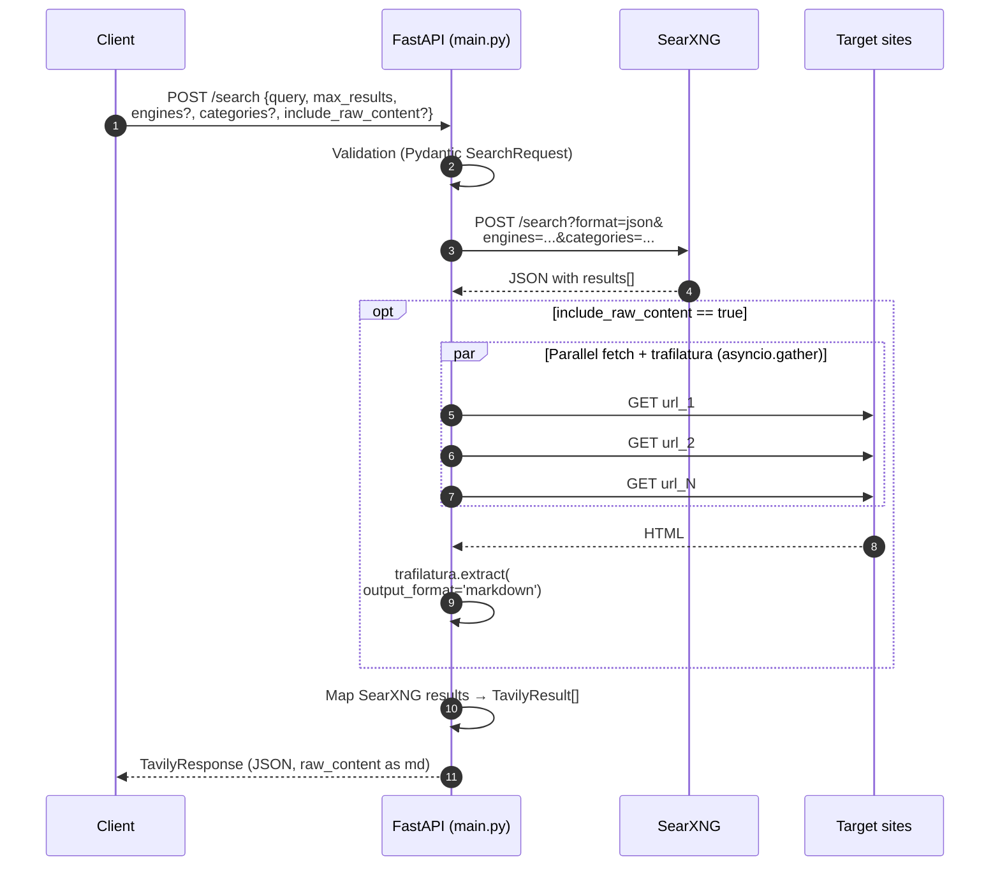
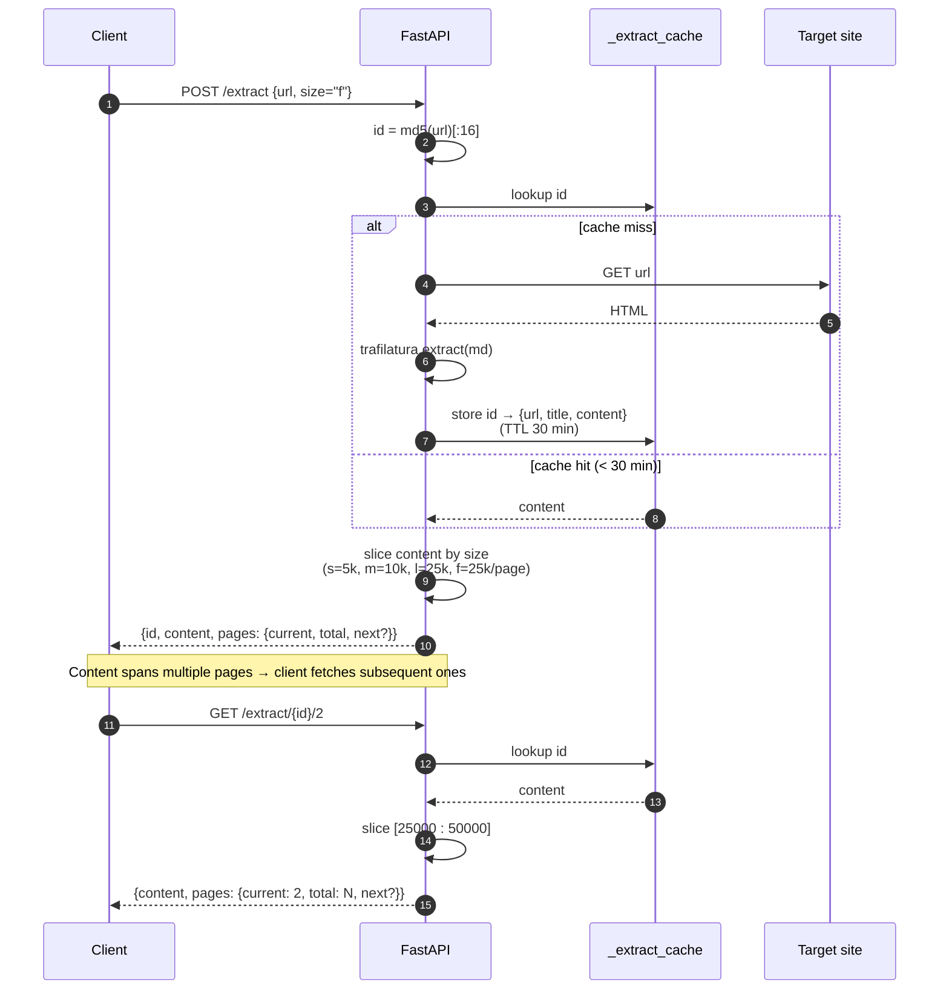
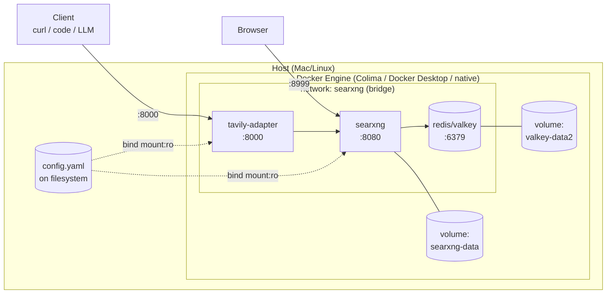

# Architecture (C4)

System described in the [C4 model](https://c4model.com/) notation: three levels from broad to narrow — Context, Container, Component. Diagrams are Mermaid — render in GitHub and most IDEs.

---

## Level 1. System Context

How the system looks from the outside: who interacts with it and what external services it talks to.

**System boundaries:**
- Everything inside the `SearXNG Tavily Adapter` frame comes up with a single `docker compose up -d`.
- Search engines and target sites are the public internet — we don't own their availability or rate limits.

---

## Level 2. Container

System split into containers (in C4 sense — "units of deployment"). Here that maps 1:1 to Docker Compose services.

### Breakdown

| Container | Image / build | Host port | Volume / config |
|---|---|---|---|
| `tavily-adapter` | `ghcr.io/vakovalskii/searcharvester:latest` (or build `./simple_tavily_adapter`) | **8000** → 8000 | `./config.yaml:/srv/searxng-docker/config.yaml:ro` |
| `searxng` | `docker.io/searxng/searxng:latest` | **8999** → 8080 | `./config.yaml:/etc/searxng/settings.yml:ro`, `searxng-data:/var/cache/searxng` |
| `redis` | `docker.io/valkey/valkey:8-alpine` | — (not published) | `valkey-data2:/data` |

All three live in the same `searxng` Docker network and address each other by service name (`searxng`, `redis`).

### Key SearXNG env vars (set in `docker-compose.yaml`)

- `SEARXNG_BASE_URL=http://localhost:8999/`
- `BIND_ADDRESS=[::]:8080`

---

## Level 3. Component (inside the Tavily Adapter)

What happens inside the `tavily-adapter` container — Python modules and their roles.

### Sequence: `POST /search`

### Sequence: `POST /extract` + pagination

### Files and their responsibilities

| File | Role |
|---|---|
| `simple_tavily_adapter/main.py` | FastAPI app. Endpoints: `POST /search`, `POST /extract`, `GET /extract/{id}/{page}`, `GET /health`. Houses trafilatura extractor and in-memory cache |
| `simple_tavily_adapter/tavily_client.py` | Python class `TavilyClient`, mirroring `tavily-python` API. For scripts that don't want HTTP |
| `simple_tavily_adapter/config_loader.py` | Reads unified `config.yaml`, exposes params via `@property` |
| `simple_tavily_adapter/Dockerfile` | `python:3.11-slim` + `curl` for health-check. Runs `uvicorn main:app` |
| `simple_tavily_adapter/requirements.txt` | FastAPI, aiohttp, **trafilatura**, **lxml**, pydantic, pyyaml |
| `simple_tavily_adapter/test_client.py` | Smoke test for `TavilyClient` |

### Config actually read by the code

- `adapter.searxng_url` → where the adapter calls
- `adapter.server.host`, `adapter.server.port` → uvicorn bind
- `adapter.scraper.timeout` → per-page timeout
- `adapter.scraper.max_content_length` → `raw_content` length limit
- `adapter.scraper.user_agent` → User-Agent for scraping

**Not read by the code (hardcoded)**: `adapter.search.default_engines`, `default_categories`, `default_language`, `safesearch`, `default_max_results`. They exist as properties in `config_loader.py` but aren't applied in `main.py`. Known wart — see [`../../CLAUDE.md`](../../CLAUDE.md).

---

## Deployment view

A single `config.yaml` is mounted read-only into two containers: SearXNG sees it as its `settings.yml`, the adapter sees it as its config. This is deliberate — avoids keeping two files in sync.

---

## What's intentionally simplified

- **No HTTPS / reverse proxy.** The repo has a `Caddyfile` inherited from upstream `searxng-docker`, but it's not wired into `docker-compose.yaml`. If you need TLS, add a Caddy service and expose 80/443.
- **No limiter / auth.** `limiter: false` in config — fine for a local machine, not fine for a public endpoint.
- **`/search` score is fake** (`0.9 - i*0.05`). SearXNG does provide real relevance, but the adapter doesn't forward it.
- **`/extract` cache is in-memory, no persistence.** After container restart, stale ids require a fresh `POST /extract`. TTL 30 minutes.
- **`/extract` — one URL per call.** Batch extraction (list of URLs) isn't implemented.
