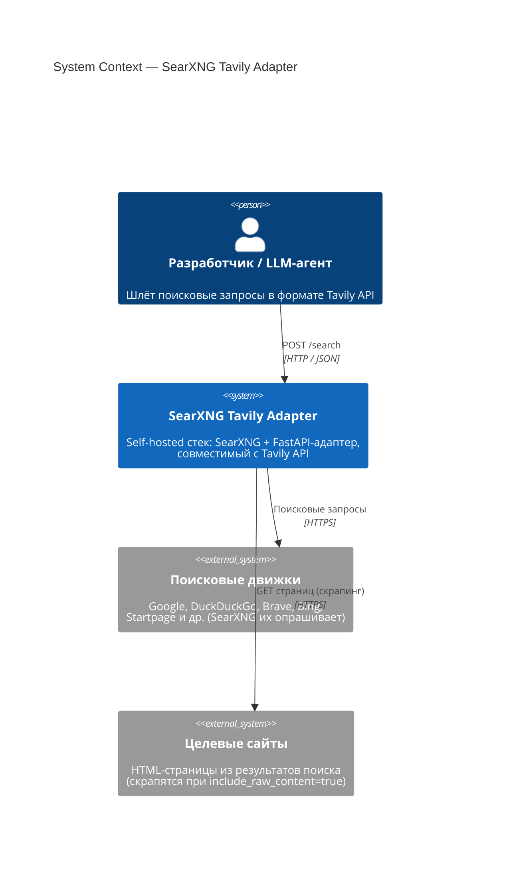
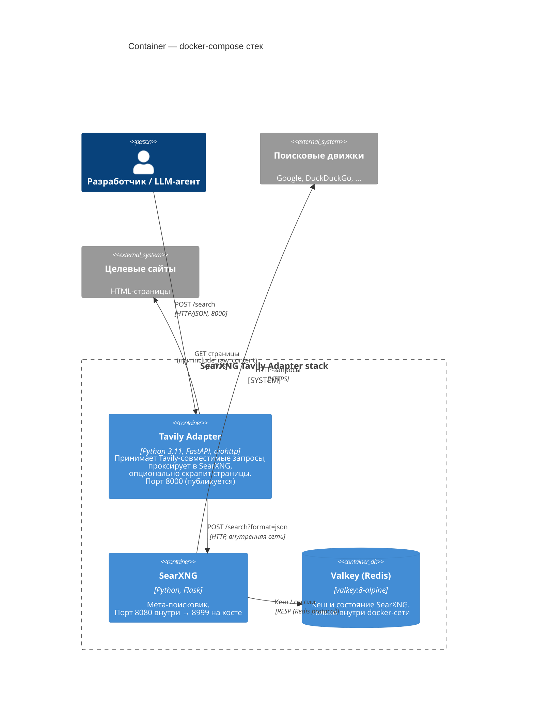
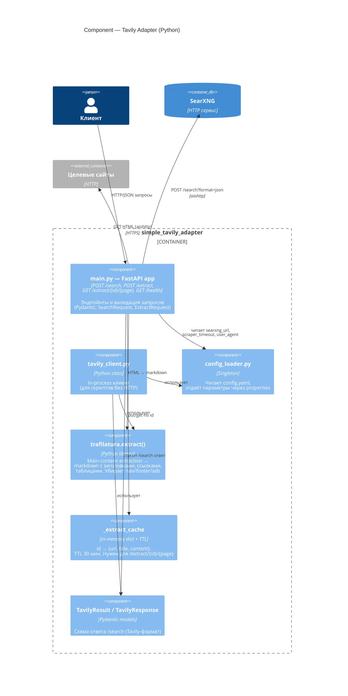
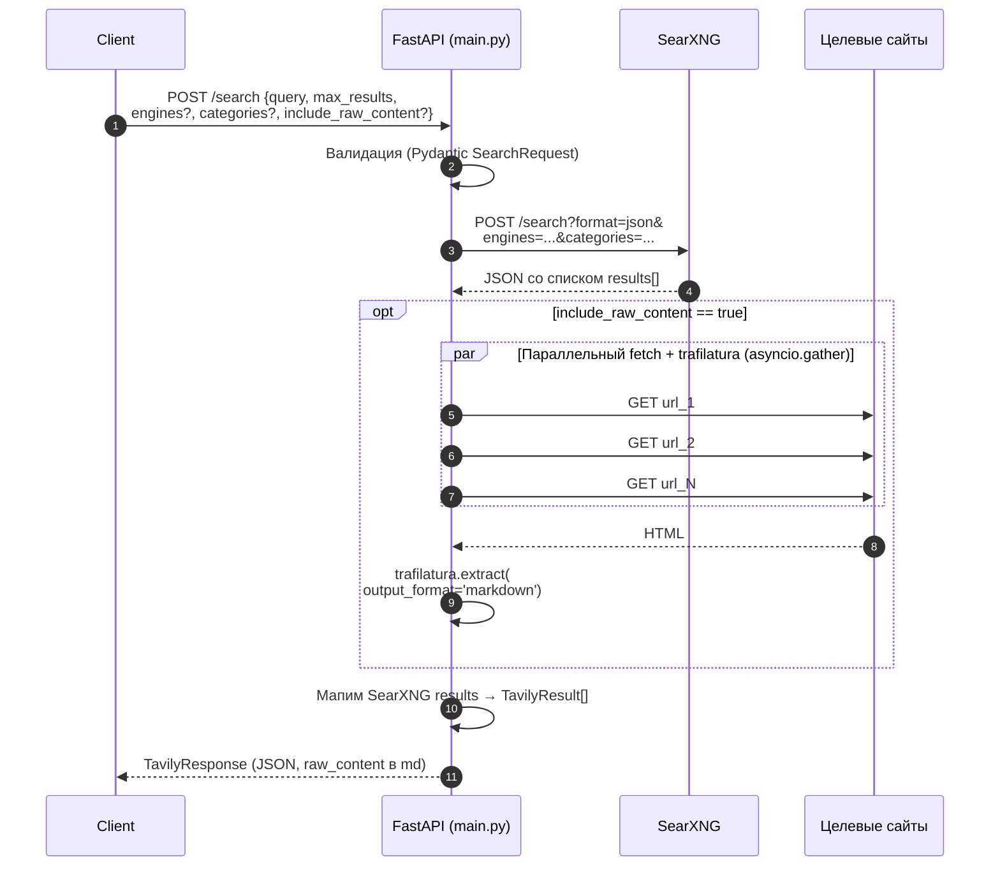
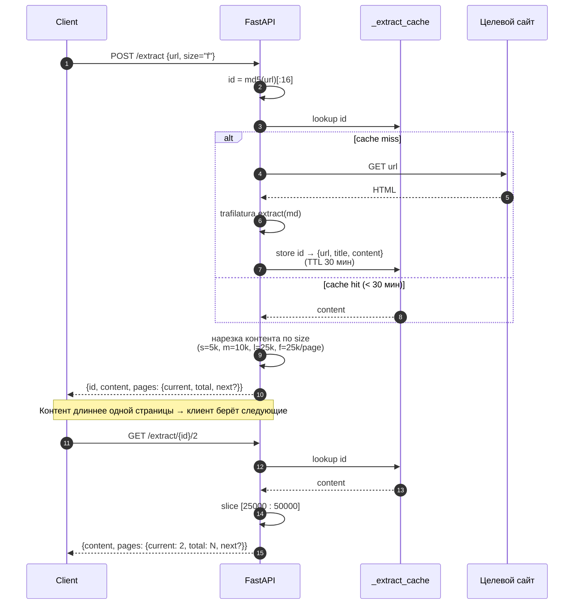
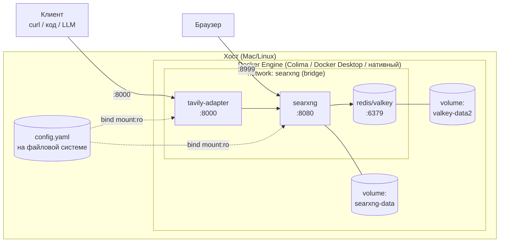

# Архитектура (C4)

Описание системы в нотации [C4 model](https://c4model.com/): три уровня от общего к частному — Context, Container, Component. Диаграммы в Mermaid — рендерятся в GitHub и большинстве IDE.

---

## Уровень 1. System Context

Как система видна снаружи: кто с ней взаимодействует и с какими внешними сервисами она работает.

**Границы системы:**
- Всё, что внутри рамки `SearXNG Tavily Adapter`, — поднимается одной командой `docker compose up -d`.
- Поисковые движки и целевые сайты — это публичный интернет, за их доступность и rate limits мы не отвечаем.

---

## Уровень 2. Container

Разбивка системы на контейнеры (в смысле C4 — «единицы деплоя»). В нашем случае совпадает с сервисами Docker Compose.

### Разрезы

| Контейнер | Образ / сборка | Порт хоста | Volume / конфиг |
|---|---|---|---|
| `tavily-adapter` | build `./simple_tavily_adapter` | **8000** → 8000 | `./config.yaml:/srv/searxng-docker/config.yaml:ro` |
| `searxng` | `docker.io/searxng/searxng:latest` | **8999** → 8080 | `./config.yaml:/etc/searxng/settings.yml:ro`, `searxng-data:/var/cache/searxng` |
| `redis` | `docker.io/valkey/valkey:8-alpine` | — (не публикуется) | `valkey-data2:/data` |

Все три сидят в одной docker-сети `searxng`, общаются по именам сервисов (`searxng`, `redis`).

### Ключевые env-переменные SearXNG (задаются в `docker-compose.yaml`)

- `SEARXNG_BASE_URL=http://localhost:8999/`
- `BIND_ADDRESS=[::]:8080`

---

## Уровень 3. Component (внутри Tavily Adapter)

Что происходит внутри контейнера `tavily-adapter` — модули Python-кода и их роли.

### Sequence: `POST /search`

### Sequence: `POST /extract` + пагинация

### Файлы и их ответственность

| Файл | Роль |
|---|---|
| `simple_tavily_adapter/main.py` | FastAPI-приложение. Эндпойнты: `POST /search`, `POST /extract`, `GET /extract/{id}/{page}`, `GET /health`. Содержит trafilatura-экстрактор и in-memory кеш |
| `simple_tavily_adapter/tavily_client.py` | Python-класс `TavilyClient`, зеркалирующий API `tavily-python`. Для скриптов без HTTP |
| `simple_tavily_adapter/config_loader.py` | Читает единый `config.yaml`, отдаёт параметры через `@property` |
| `simple_tavily_adapter/Dockerfile` | `python:3.11-slim` + `curl` для health-check. Запускает `uvicorn main:app` |
| `simple_tavily_adapter/requirements.txt` | FastAPI, aiohttp, **trafilatura**, **lxml**, pydantic, pyyaml |
| `simple_tavily_adapter/test_client.py` | Smoke-тест для `TavilyClient` |

### Конфигурация, которая реально читается кодом

- `adapter.searxng_url` → куда адаптер стучится
- `adapter.server.host`, `adapter.server.port` → uvicorn bind
- `adapter.scraper.timeout` → таймаут на одну страницу
- `adapter.scraper.max_content_length` → размер `raw_content`
- `adapter.scraper.user_agent` → User-Agent при скрапинге

**Не читаются кодом (захардкожено)**: `adapter.search.default_engines`, `default_categories`, `default_language`, `safesearch`, `default_max_results`. Они есть в `config_loader.py` как property, но не применяются в `main.py`. Это известная шероховатость — см. [`../CLAUDE.md`](../CLAUDE.md).

---

## Деплой (Deployment view)

Один файл `config.yaml` монтируется в два контейнера read-only: в SearXNG как его `settings.yml`, в адаптер — как его конфиг. Это сделано осознанно: чтобы не держать два синхронизированных файла.

---

## Что сознательно упрощено

- **Нет HTTPS / reverse proxy.** В репе лежит `Caddyfile` от upstream `searxng-docker`, но в `docker-compose.yaml` он не подключён. Если нужен TLS — добавить сервис Caddy и пробросить 80/443.
- **Нет лимитера / auth.** `limiter: false` в конфиге — ок для локальной машины, не ок для публичного эндпойнта.
- **Скор результата в `/search` — фейковый** (`0.9 - i*0.05`). Real relevance SearXNG даёт, но адаптер его не пробрасывает.
- **Кеш `/extract` — in-memory, без персистентности.** После рестарта контейнера просроченные id требуют повторного `POST /extract`. TTL 30 минут.
- **`/extract` — один URL за вызов.** Batch-извлечение (список URL) не реализовано.
