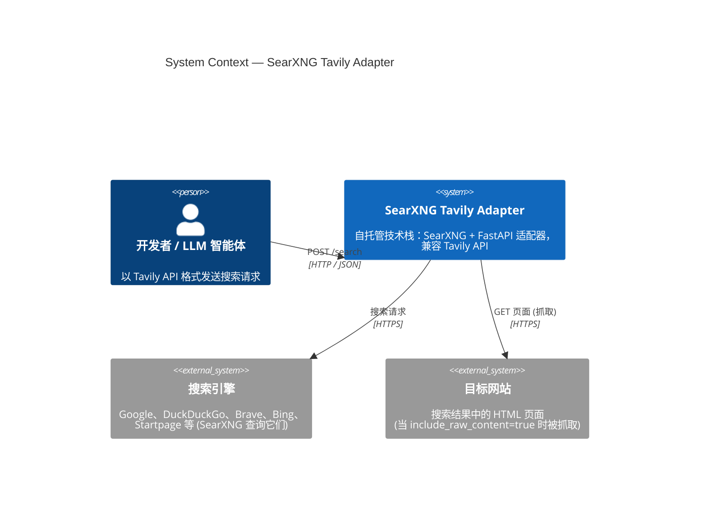
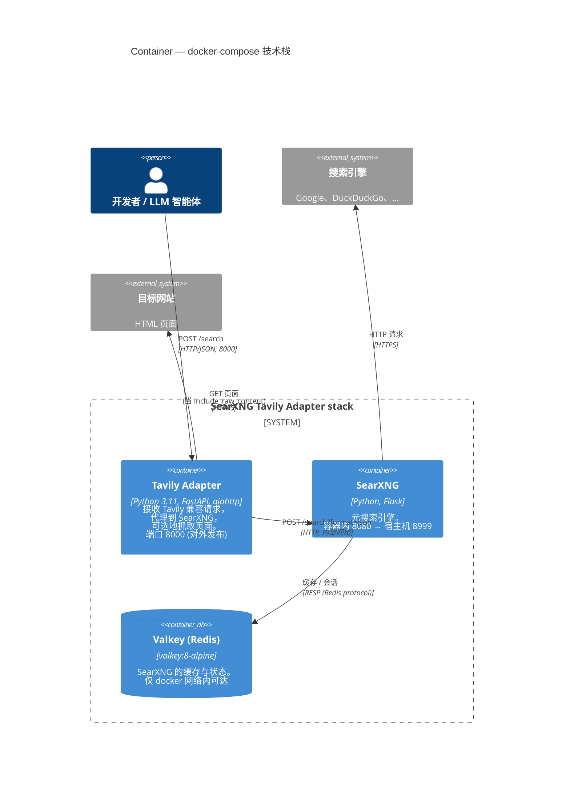
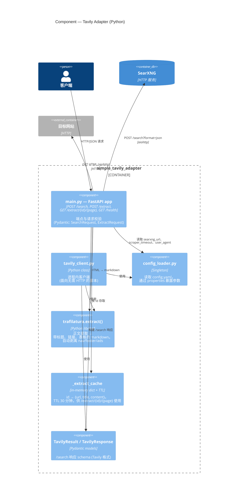
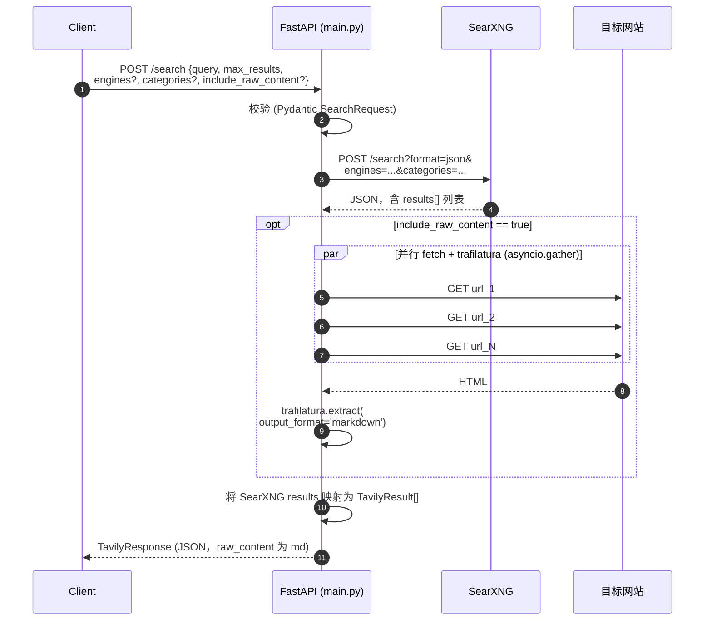
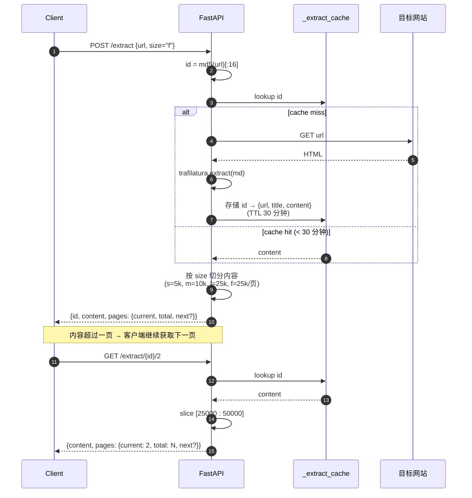
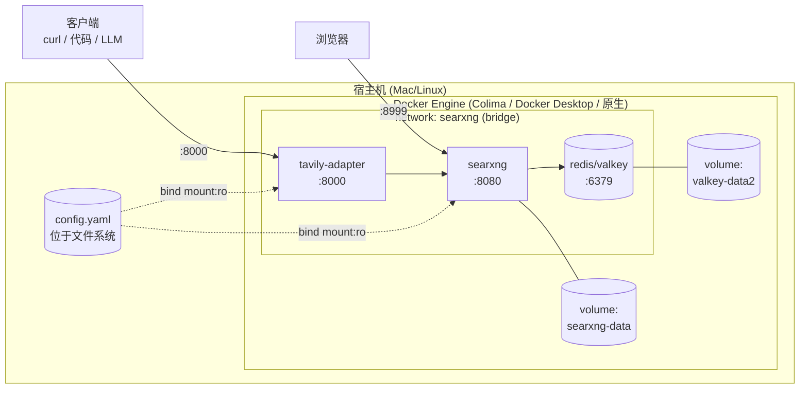

# 架构 (C4)

采用 [C4 model](https://c4model.com/) 的三层视图，由粗到细：Context、Container、Component。图表使用 Mermaid 绘制，可在 GitHub 和大多数 IDE 中直接渲染。

---

## 第 1 层. System Context

系统的对外视角：谁在和它交互，以及它依赖哪些外部服务。

**系统边界：**
- `SearXNG Tavily Adapter` 框内的一切，通过一条 `docker compose up -d` 命令即可启动。
- 搜索引擎与目标网站属于公共互联网，其可用性与限流不在本项目控制范围内。

---

## 第 2 层. Container

把系统拆分为容器（C4 语境下的"部署单元"）。在本项目中与 Docker Compose 服务一一对应。

### 分项

| 容器 | 镜像 / 构建 | 宿主机端口 | Volume / 配置 |
|---|---|---|---|
| `tavily-adapter` | build `./simple_tavily_adapter` | **8000** → 8000 | `./config.yaml:/srv/searxng-docker/config.yaml:ro` |
| `searxng` | `docker.io/searxng/searxng:latest` | **8999** → 8080 | `./config.yaml:/etc/searxng/settings.yml:ro`, `searxng-data:/var/cache/searxng` |
| `redis` | `docker.io/valkey/valkey:8-alpine` | — (不发布) | `valkey-data2:/data` |

三个容器都位于同一 docker 网络 `searxng`，通过服务名 (`searxng`、`redis`) 相互访问。

### SearXNG 关键环境变量（在 `docker-compose.yaml` 中设置）

- `SEARXNG_BASE_URL=http://localhost:8999/`
- `BIND_ADDRESS=[::]:8080`

---

## 第 3 层. Component (Tavily Adapter 内部)

`tavily-adapter` 容器内部发生了什么 — Python 代码模块及其职责。

### Sequence: `POST /search`

### Sequence: `POST /extract` + 分页

### 文件与职责

| 文件 | 职责 |
|---|---|
| `simple_tavily_adapter/main.py` | FastAPI 应用。端点：`POST /search`、`POST /extract`、`GET /extract/{id}/{page}`、`GET /health`。包含 trafilatura 提取器和内存缓存 |
| `simple_tavily_adapter/tavily_client.py` | Python 类 `TavilyClient`，镜像 `tavily-python` 的 API。面向无需 HTTP 的脚本 |
| `simple_tavily_adapter/config_loader.py` | 读取统一的 `config.yaml`，通过 `@property` 暴露参数 |
| `simple_tavily_adapter/Dockerfile` | `python:3.11-slim` + 用于健康检查的 `curl`。启动 `uvicorn main:app` |
| `simple_tavily_adapter/requirements.txt` | FastAPI, aiohttp, **trafilatura**, **lxml**, pydantic, pyyaml |
| `simple_tavily_adapter/test_client.py` | `TavilyClient` 的冒烟测试 |

### 代码实际读取的配置项

- `adapter.searxng_url` → 适配器访问 SearXNG 的地址
- `adapter.server.host`、`adapter.server.port` → uvicorn 绑定地址
- `adapter.scraper.timeout` → 单页抓取超时
- `adapter.scraper.max_content_length` → `raw_content` 长度上限
- `adapter.scraper.user_agent` → 抓取时使用的 User-Agent

**未被代码读取（已硬编码）**：`adapter.search.default_engines`、`default_categories`、`default_language`、`safesearch`、`default_max_results`。这些字段在 `config_loader.py` 中作为 property 存在，但未在 `main.py` 中应用。属已知的遗留问题 — 详见 [`../CLAUDE.md`](../CLAUDE.md)。

---

## 部署 (Deployment view)

同一份 `config.yaml` 以只读方式挂载到两个容器：对 SearXNG 来说是 `settings.yml`，对适配器来说是它的配置文件。这是刻意设计的：避免维护两份相互同步的文件。

---

## 刻意简化之处

- **没有 HTTPS / 反向代理。** 仓库中保留了 upstream `searxng-docker` 的 `Caddyfile`，但未在 `docker-compose.yaml` 中启用。如果需要 TLS — 添加 Caddy 服务并暴露 80/443。
- **没有限流器 / 鉴权。** 配置中的 `limiter: false` 对本地开发够用，对公网端点则不适合。
- **`/search` 中的 score 是伪造的** (`0.9 - i*0.05`)。SearXNG 本身提供真实相关度，但适配器未透传。
- **`/extract` 缓存是内存态，无持久化。** 容器重启后，已过期的 id 需要重新发起 `POST /extract`。TTL 30 分钟。
- **`/extract` 每次调用仅处理一个 URL。** 未实现批量提取（URL 列表）。
